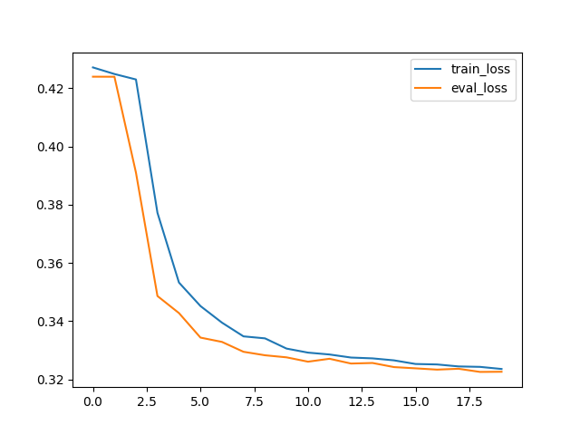

# ImageSeg-UNet

This notebook implements an image segmentation on the highway scene from the Change Detection dataset: http://jacarini.dinf.usherbrooke.ca/dataset2014#

 

# Procedure

- load dataset
- resize images to 40x53 (~1/3) to make it more tractable
- increase number of examples by augment images
    - change brightness by a random factor
    - change contrast by a random factor
- train model

# Architecture

The model is inspired by the U-Net architecture https://arxiv.org/abs/1505.04597 with further residual connections.

# Training

# Results

